# Docker Build Fails (no space left on device)

```yml
FROM ubuntu:20.04
RUN apt-get update && apt-get install -y nodejs npm
COPY . /app
WORKDIR /app
RUN npm install
CMD ["node", "index.js"]
#Tasks

#Diagnose the CI disk full issue
#Propose temporary and permanent fixes
#Define monitoring measures to detect/prevent it
```

## 1. Diagnose the CI disk full issue

```bash
# Check docker root dir
docker info | grep "Docker Root Dir"

# Check disk usage
df -h

# Detailed partitioning view
sudo lsblk

# Check which partitions /var/lib/docker is on
df -h /var/lib/docker

# Show total disk usage by Docker's data directory
sudo du -sh /var/lib/docker/* | sort -h

#Windows/Docker Desktop (WSL2) volume storage reference
\\wsl.localhost\docker-desktop\tmp\docker-desktop-root\var\lib\docker\volumes
C:\Users\(name)\AppData\Local\Docker\wsl\disk
wsl -d docker-desktop
du sh /tmp/docker-desktop-root/var/lib* | sort -h

#Display inode usage on mounted partitions
df -i

# Show Docker images, containers, and build cache sizes
docker system df -v
```

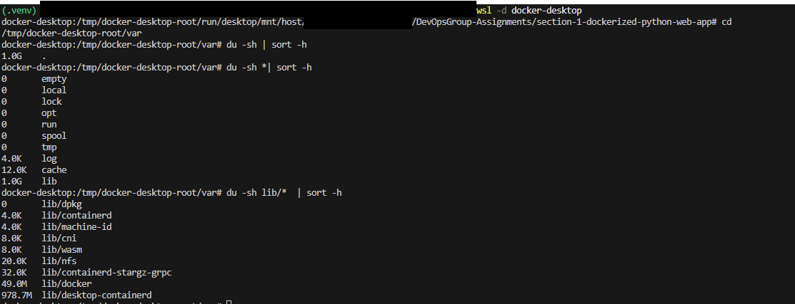

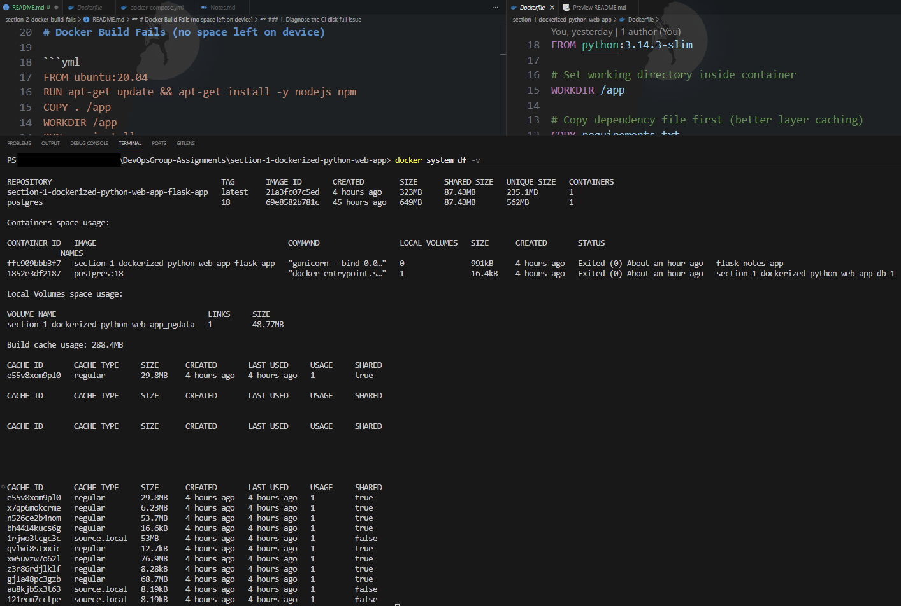

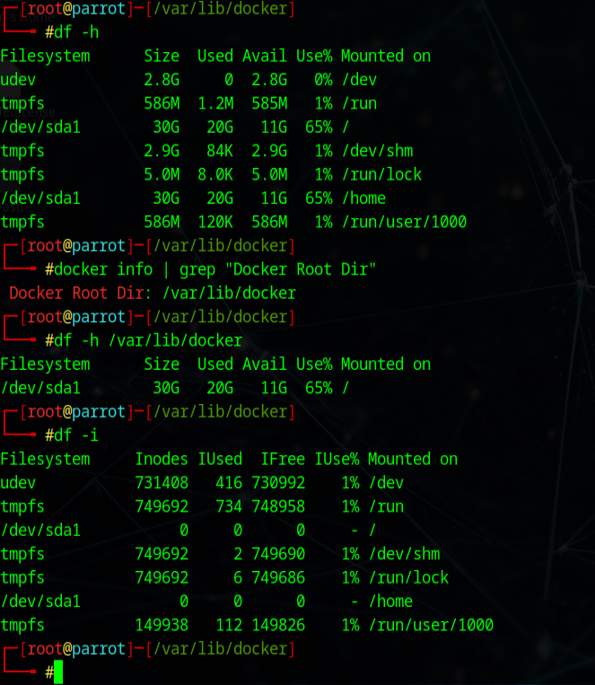

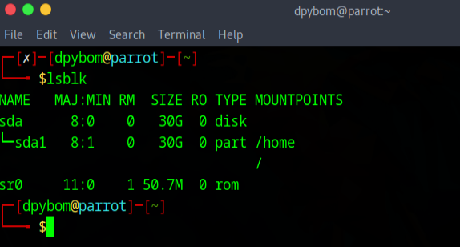

---

## 2. Propose temporary and permanent fixes

### A. Temporary fixes

```bash
#Clean Docker cache, stopped containers, unused networks, dangling images,
# dangling build cache, and unused volumes
docker system prune --all --force --volumes

#Sidenote: these can be also cleaned/removed by replacing system part with: container, image, network or volume prune

# Clean only build cache
docker builder prune -a

# Use filters to prune selectively
# Remove builder cache older than 24 hours
docker builder prune --filter "until=24h"

# Remove unused system resources based on Docker labels
# Create a label in Dockerfile
LABEL foo="bar"

#Script, can be used with or without key
#label=<key>, label=<key>=<value>, label!=<key>, or label!=<key>=<value>

# Remove all unused containers, networks, images without the specified label and key
docker system prune --filter label!=foo="bar"

# Remove all unused containers, networks, images with the specified label
docker system prune --filter label=foo="bar"
```

### B. Permanent fixes

```bash
# 1. From a Dockerfile perspective (Assuming whatever is written (OS, etc.) is not required in its current form)

#A. Use a smaller base image, with node and npm included
#E.g:
FROM node:25-alpine #or FROM node:25-slim

#B. Optimize node download in case Ubuntu image needs to stay
#Due to its stacking for each Dockerfile is built
RUN apt-get update && \
    apt-get install -y nodejs npm && \
    apt-get clean && \
    rm -rf /var/lib/apt/lists/* #Removes repository metadata

#C. Remove unncessary files in repo before build
# to prevent copying logs, .git, node_modules, or temp files
.dockerignore file

#D. Instead of npm install use nmp ci and ideally multi-stage build
#E.g:
# Build stage
FROM node:20-alpine AS builder

# Set working directory
WORKDIR /app

# Copy package files
COPY package*.json ./

# Install dependencies
RUN npm ci --only=production && npm cache clean --force

# Start the application
CMD ["node", "index.js"]
#-----------------------------------------------------------------------------------------------------------------------------------

#2. Expand resources

#A. Windows - WSL2 - diskpart

#To actually find the distributions/WSL partitions
#Get-ChildItem "HKCU:\Software\Microsoft\Windows\CurrentVersion\Lxss" -Recurse
wsl --shutdown
diskpart
select vdisk file="C:\Users\(name)\AppData\Local\Docker\wsl\disk\docker_data.vhdx"
compact vdisk # Clears unused space, this can be done for
#Make sure docker desktop and engine is turned off

#To expand VHD
wsl --manage <distribution name> --resize <memory string>
#Or with diskpart once again
select vdisk file="C:\Users\(name)\AppData\Local\Docker\wsl\disk\docker_data.vhdx"
expand vdisk maximum=<sizeInMegaBytes>


#B. Linux VM

#Increase media in VM manager (Example from VirtualBox below)
#Use gparted(Example below) or resize2fs to resize/shrink the partition tables
#Automatically resize a filesystem to its maximum possible size:
resize2fs /dev/sdXN
#Resize the filesystem to a size of 40G, displaying a progress bar:
resize2fs -p /dev/sdXN 40G
#Shrink the filesystem to its minimum possible size:
resize2fs -M /dev/sdXN


#C. Resize on Cloud level (AWS as example)

#Modify volume in AWS
#SSH into instance
# To ensure partition was extended
sudo lsblk
# Extend the partition
#Nitro example sudo growpart /dev/nvme0n1 (partition number)
sudo growpart /dev/nvme0n1 1
#Xen instance example sudo growpart /dev/xvda (partition number)
sudo growpart /dev/xvda 1
```

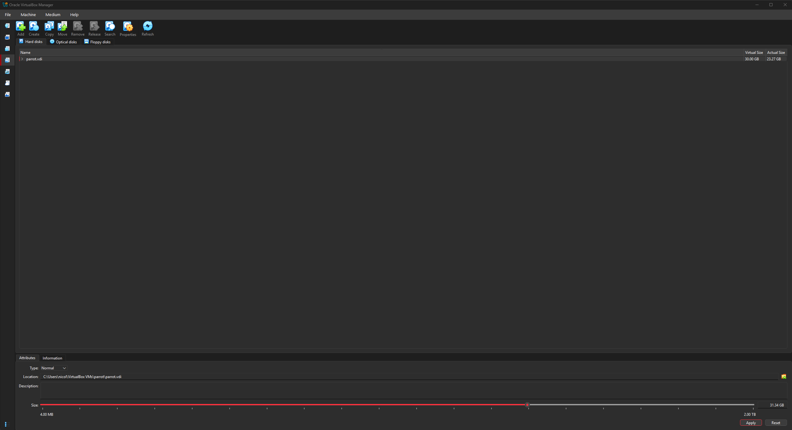
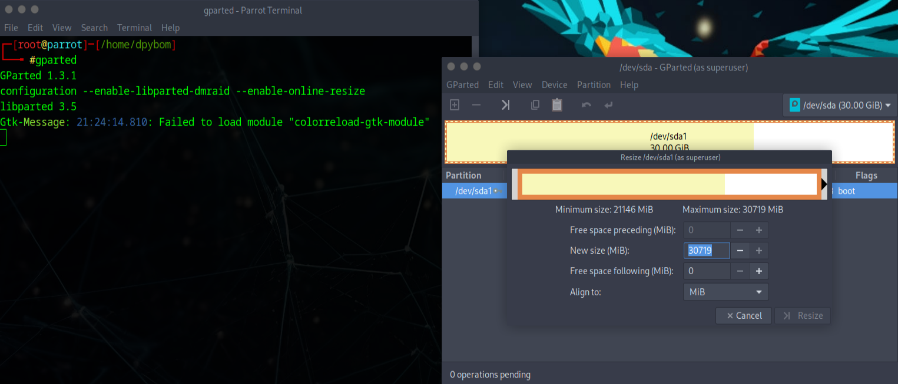
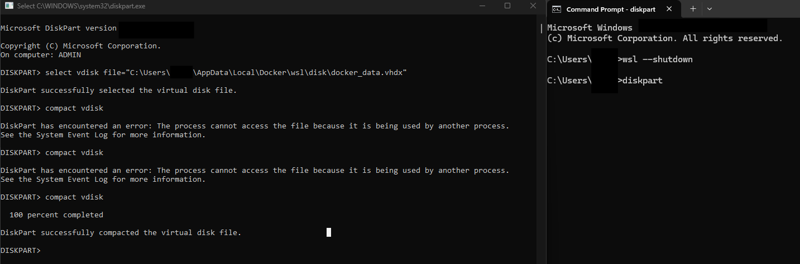
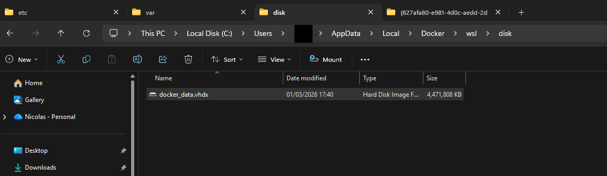
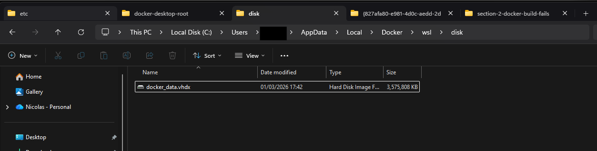
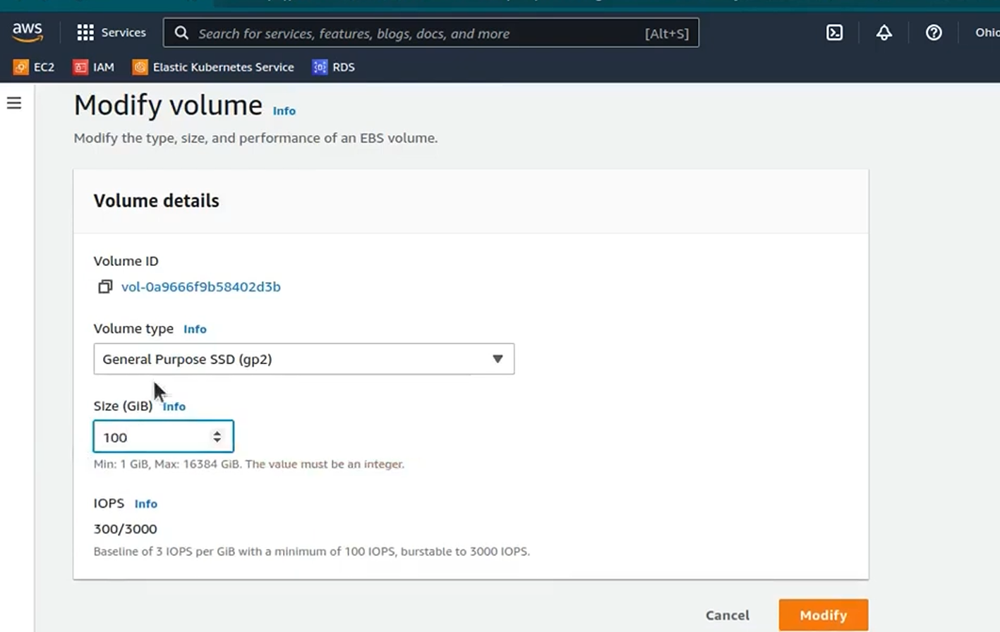
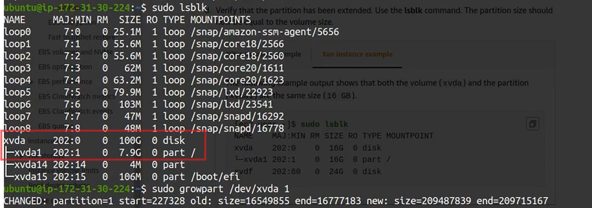
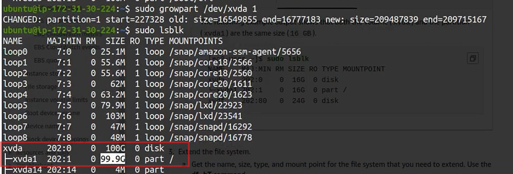

---

## 3. Define monitoring measures to detect/prevent it

```bash
#Implement Prometheus and/or ELK stack, possibly graphana for prometheus visualization, trends
#Prometheus rule set example
ALERT NodeLowRootDisk
  IF ((node_filesystem_size{mountpoint="/root-disk"} - node_filesystem_free{mountpoint="/root-disk"} ) / node_filesystem_size{mountpoint="/root-disk"} * 100) > 75
  FOR 2m
  LABELS {
    severity="page"
  }
  ANNOTATIONS {
    SUMMARY = "{{$labels.instance}}: Low root disk space",
    DESCRIPTION = "{{$labels.instance}}: Root disk usage is above 75% (current value is: {{ $value }})"
  }

ALERT NodeLowDataDisk
  IF ((node_filesystem_size{mountpoint="/data-disk"} - node_filesystem_free{mountpoint="/data-disk"} ) / node_filesystem_size{mountpoint="/data-disk"} * 100) > 75
  FOR 2m
  LABELS {
    severity="page"
  }
  ANNOTATIONS {
    SUMMARY = "{{$labels.instance}}: Low data disk space",
    DESCRIPTION = "{{$labels.instance}}: Data disk usage is above 75% (current value is: {{ $value }})"
  }

#Additional log suplementation could be done via cron jobs
0 */6 * * * docker system df >> /var/log/docker-usage.log
# Prune unused resources older than 7 days
docker system prune -af --filter "until=168h"

#Catch no disk space during build
#E.g: Jenkins
pipeline {
    agent any

    stages {
        stage('📊 Check Full Disk Usage') {
            steps {
                sh '''
                    echo "📍 Overall Disk Usage:"
                    df -h
                '''
            }
        }

        stage('📁 Check Workspace Size') {
            steps {
                sh '''
                    echo "📦 Workspace Size:"
                    du -sh .

                    echo ""
                    echo "🔍 Top 10 Largest Items in Workspace:"
                    du -h . | sort -hr | head -n 10
                '''
            }
        }

        stage('⚠️ Disk Usage Alert') {
            steps {
                script {
                    def usage = sh(
                        script: "df --output=pcent / | tail -1 | tr -dc '0-9'",
                        returnStdout: true
                    ).trim()

                    echo "📈 Root disk usage: ${usage}%"

                    if (usage.toInteger() > 90) {
                        error("❌ Disk usage is over 90%! Build aborted.")
                    } else {
                        echo "✅ Disk usage is within safe limits."
                    }
                }
            }
        }
    }

    post {
        always {
            echo "🧾 Disk check completed at ${new Date()}"
        }
    }
}
```

---

##### References:

This document is based on:

- Linux manual pages (resize2fs, growpart, df, lsblk...)
- Docker Official Documentation
- AWS EC2 Volume Management Documentation
- Prometheus Alerting Rules Documentation
- Grafana Monitoring & Alerting Documentation
- Jenkins Pipeline Documentation
- Community best practices and open-source monitoring implementations
